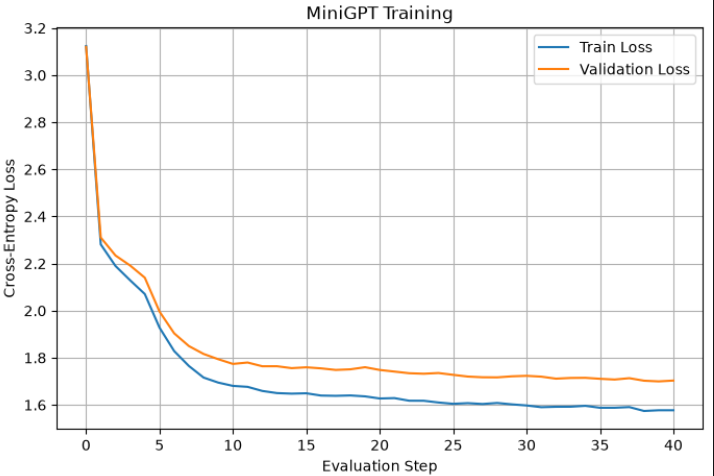
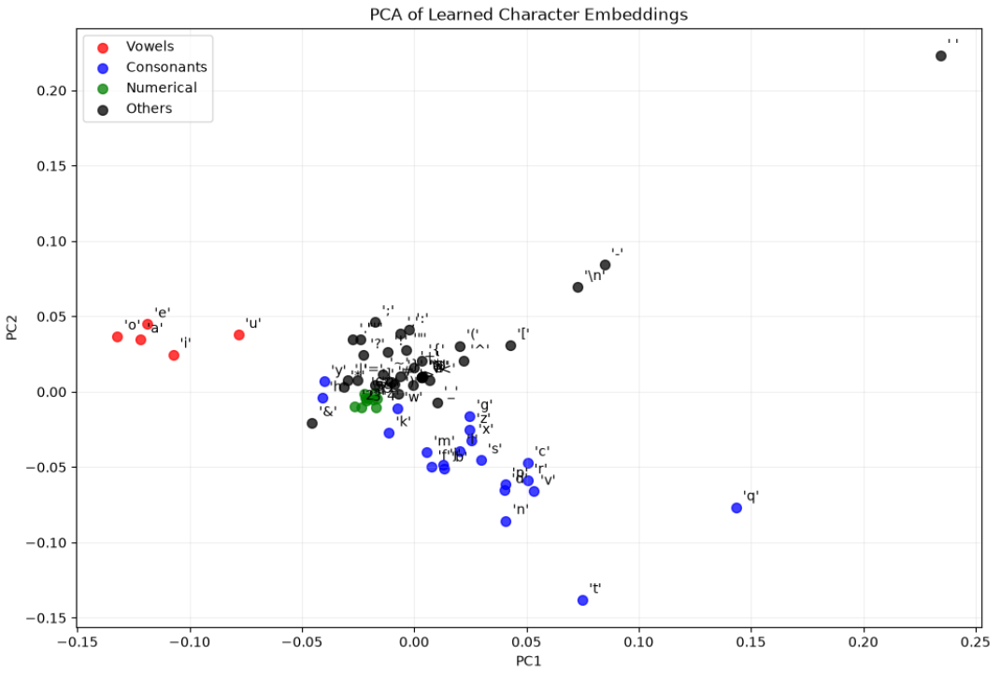

# MiniGPT — Character-Level Language Model

MiniGPT is a **character-level language model built from scratch in PyTorch**, implementing a compact GPT-2-style Transformer for next-character prediction.

The project includes progressively larger models, local training experiments, a complete end-to-end training pipeline, checkpoint loading, text generation, perplexity evaluation, and character-embedding visualization.

---

## Project Structure

```text
miniGPT-char-level-LM/
│
├── data/
│   ├── input.txt  # 1 MB text data used for training - 1.1M chars
│
├── models/
│   ├── mini_gpt_best_221k_param.pth # 221k param model
│   ├── mini_gpt_checkpoint_221k_param.pth  # checkpoint for 221k param model
│   ├── mini_gpt_best.pth  # 1.88M param model
│   └── mini_gpt_checkpoint.pth # checkpoint for 1.88 param model
│
├── notebooks/
│   ├── MLP predictor.ipynb  # End-to-end MLP implementation for next-char prediction
│   └── miniGPT_local_training.ipynb  # Training of 221k parameter model
│
├── embedding_model/ # 21.43M parameter model trained on 250 MB (250M chars) data
│   ├──models/ 
│         ├── mini_gpt_best.pth
│         ├── mini_gpt_checkpoint.pth
│   ├── Train.ipynb
│   ├── Test.ipynb
|
├── src/
│   ├── __init__.py
│   ├── config.py # Model configurations
│   ├── data.py   # Tokenizer, data processing & loading
│   ├── model.py  # Transformer block & miniGPT implementation
│   ├── train.py  # Training functionalities
│   └── utils.py  # Seed, parameter count, checkpointing & plotting
│
├── Train.ipynb  # Training of 1.88M parameter model
├── Test.ipynb   # Testing of 1.88M parameter model
└── data_downloader.ipynb # Code to download ~300 book (~250 MB) text data & merge into data/input.txt
```

---

## Data

### `data/input.txt`

* Original text length: **111,539 characters**
* Cleaned text length: **106,823 characters**
* Vocabulary size: **29 characters**
* Training characters: **96,140**
* Validation characters: **10,683**

---

# Model Training — `Train.ipynb`



### Main model configuration

| Parameter              |    Value |
| ---------------------- | -------: |
| Context length         |    `128` |
| Embedding dimension    |    `160` |
| Attention heads        |      `8` |
| Transformer layers     |      `6` |
| Dropout                |    `0.0` |
| Batch size             |     `64` |
| Learning rate          |   `2e-4` |
| Weight decay           |   `0.01` |
| Training iterations    | `10,000` |
| Evaluation interval    |    `250` |
| Evaluation iterations  |    `100` |
| Train/validation split |  `90/10` |
| Vocabulary size        |     `29` |

---
### Architecture

The model consists of:

```text
Character + positional embeddings
        ↓
6 × TransformerBlock
        ├── LayerNorm
        ├── Multi-Head Causal Self-Attention
        ├── Residual connection
        ├── LayerNorm
        ├── Feed-Forward Network
        └── Residual connection
        ↓
Final LayerNorm
        ↓
Linear language-modeling head
        ↓
29 character logits
```

### Training results

| Metric                |                Result |
| --------------------- | --------------------: |
| Train Loss            |            **1.5771** |
| Validation Loss       |            **1.6997** |
| Train Perplexity      |              **4.83** |
| Validation Perplexity |              **5.47** |
| Parameters            | **1,882,880 (1.88M)** |

---

# Testing & Generation — `Test.ipynb`

Generation testing for

```text
Temperature = 0.5   → more conservative generation
Temperature = 1.5   → more random generation
Temperature = 0.8
Top-K = 10          → restricted sampling
```

### Generation Results

Prompt used:

`The night was quiet, and the wind carried`

| Generation mode      | Temperature | Top-K | Observed output                                                                                                                                  |
| -------------------- | ----------: | ----: | ------------------------------------------------------------------------------------------------------------------------------------------------ |
| **Default sampling** |         1.0 |     — | Moderately random character-level text. The model produces recognizable English-like fragments, but with frequent misspellings and broken words. |
| **Conservative**     |         0.5 |     — | More repetitive and predictable. Produces more common words and sentence-like patterns, but has limited diversity.                               |
| **More Random**      |         1.5 |     — | Highly diverse but much less coherent. Contains many malformed words and character sequences.                                                    |
| **Top-K Sampling**   |         0.8 |    10 | Restricts sampling to the most likely tokens, producing more stable English-like text while retaining some diversity.                            |

#### Example outputs

```text
Prompt:
The night was quiet, and the wind carried
```

**Default — temperature 1.0**

```text
the night was quiet and the wind carried
and fiend veremrs corical bring too commine held all
onet of goodli sjeaw smon
you maday an
your in the sait than how
belore shou his liglr doch oor the my.
are men word fiex romorrpaitin loy one shoulne hear by alone froolanus
to and preve
oumst lets proweelip.
qenougrys swere them boward honours.
but shorbie do kneiries
isle chart usjeed
the beyll yer that who hower down boarte
of flusme at leu
```

**Conservative — temperature 0.5**

```text
the night was quiet and the wind carried me the phe he should the shall and ming and the the receive and the people
the such and the come you their against of east the come and you be and the most my heart
and they the which he she have the sour and bring heart you are the would with forst a a with you she dour
come the now at all the people
of the shall see and you say man in not heart sore him you of instought with adn the your had th
```

**More Random — temperature 1.5**

```text
the night was quiet and the wind carried qeaudce id lo.
twars harnnw ibotied hyse. olle ink so.
see genersy anhim
ukxiigam aestifes ever
ome wins faters
a swow stachintabrd wwy to laying.
 herea
yow xl.f w

both for
iubweuntljnh attsous
shalert
no
marmd tplhims ofbek he
they wheellohainng
what idrigh makt iscloui eyef then tongorrausilby in ontiegowin wefecalinzbdfice buey xrinfabity frlyei fies the hat thop lohiw alptes
heur og at mjrw
```

**Top-K Sampling — temperature 0.8, top_k=10**

```text
the night was quiet and the wind carried marcius
why honours to they home than where haft a meeks you be are our and stow as the genents you
all say the sperserves so hour have our of the we
to you man sautin
o sare ill teath or hearts the to o the be their me they our whead a nof the parce and of well you have all worlea
all ties you sperceived and
you to all in and to take woult he speaks and of the come
the strown of are and sower mo
```
---
# Embedding Learning - from 21.43M parameter model



* **Vowels** form a clearly separated cluster.
* **Consonants** are more spread out.
* **Numbers** are tightly clustered near the center.
* **Special characters** show the largest spread.
* A few characters like `q` and `t` appear as **outliers**.
* Overall, the plot suggests that the model has learned some meaningful structure based on character type, particularly for vowels, while consonants have more varied representations

---

# Hardware & Environment

Main training was performed using:

* **GPU:** NVIDIA RTX 2050
* **VRAM:** 4 GB
* **Python:** `3.12.3`
* **PyTorch:** `2.14.0+cu126`
* **CUDA build:** `cu126`

---

# Installation

Run the following commands from the project root:

```bash
# 1. Clone the repository
git clone <https://github.com/rahulkhichar7/miniGPT-char-level-LM.git>
cd miniGPT-char-level-LM

# 2. Create and activate a virtual environment
python -m venv .venv

# Linux/macOS
source .venv/bin/activate

# Windows PowerShell
# .venv\Scripts\Activate.ps1

# 3. Install the CUDA-enabled PyTorch build used for this project
pip install torch==2.14.0 --index-url https://download.pytorch.org/whl/cu126

# 4. Install the remaining Python dependencies
pip install -r requirements.txt

# 5. Start Jupyter
jupyter notebook

# 6. Training
# Open Train.ipynb and run the notebook.

# 7. Testing / generation
# Open Test.ipynb after training to load the checkpoint,
# evaluate loss/perplexity and generate text.
```

---

# References

1. **Attention Is All You Need**
   https://arxiv.org/pdf/1706.03762

2. **Improving Language Understanding by Generative Pre-Training**
   https://cdn.openai.com/research-covers/language-unsupervised/language_understanding_paper.pdf

3. **Language Models are Unsupervised Multitask Learners**
   https://cdn.openai.com/better-language-models/language_models_are_unsupervised_multitask_learners.pdf